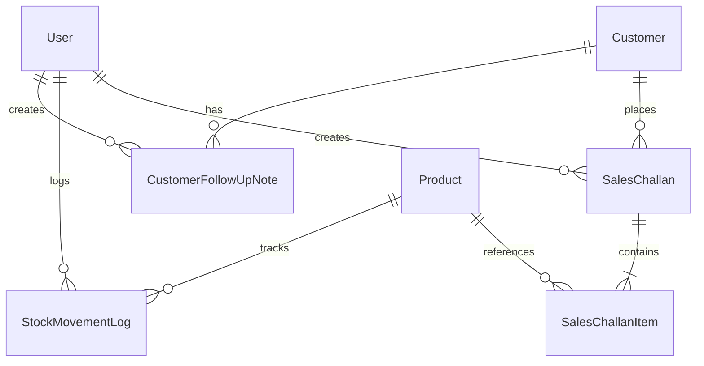

# Mini ERP + CRM Operations Portal

> **Full Stack Developer Case Study**: Wholesale & Distribution Operations Suite  
> Built with Node.js, Express, TypeScript, Prisma ORM, React (Vite), and Role-Based Access Control.

---

##  Executive Summary & Key Highlights

This application is designed specifically for wholesale and distribution businesses managing high-throughput inventory, tiered customer relationships, warehouse fulfillment, and sales challans.

- **Role-Based Access Control (RBAC)**: 4 tailored roles (**Admin**, **Sales**, **Warehouse**, **Accounts**).
- **Interactive Role Switcher**: 1-Click quick role switcher bar at the top of the app header for seamless evaluator testing.
- **Customer CRM**: Multi-tier categorization (`Retail`, `Wholesale`, `Distributor`), status tracking (`Lead`, `Active`, `Inactive`), follow-up date scheduling, and chronological interaction timeline.
- **Inventory & Warehouse**: Real-time SKU catalog, low-stock threshold alert system, and manual inward/outward adjustments with mandatory audit trails.
- **Sales Challan Business Logic**:
  - Auto-generated sequential identifiers (`CH-YYYYMM-XXXX`).
  - Immutability: Product snapshot caching (name, SKU, unit price at time of order).
  - Atomic stock deductions upon confirmation using ACID database transactions.
  - Negative-stock prevention with clear, descriptive API error diagnostics.
  - Instant print & exportable Tax Invoice / Delivery Challan in PDF format.
- **Dual Database Portability**: Runs with zero-config out-of-the-box on SQLite (`dev.db`), and includes production PostgreSQL schema and Docker Compose ready for cloud deployment (Neon, Supabase, Render, AWS RDS).

---

##  Test Login Credentials (All 4 Roles)

All demo accounts share the password: **`Password123!`**

| Role | Email | Password | Allowed Capabilities |
| :--- | :--- | :--- | :--- |
|  **Admin** | `admin@erp.com` | `Password123!` | Unrestricted full access across all CRM, Products, Logs, Challans, and Users |
|  **Sales** | `sales@erp.com` | `Password123!` | Manage Customers, schedule follow-ups, create Sales Challans (Draft/Confirmed) |
|  **Warehouse** | `warehouse@erp.com` | `Password123!` | Manage Product SKUs, execute Stock IN/OUT adjustments, monitor low stock |
|  **Accounts** | `accounts@erp.com` | `Password123!` | Inspect Challan financial totals, export/print Tax Invoices, verify billing |

> **Evaluator Tip**: In the top header bar, click on any role pill (**Admin**, **Sales**, **Warehouse**, **Accounts**) to instantly switch session context without manual re-typing!

---

##  Architecture & Database Design

```
mini-erp-crm/
├── backend/
│   ├── src/
│   │   ├── config/             # Environment configuration
│   │   ├── controllers/        # Auth, Customers, Products, Challans, Inventory, Dashboard
│   │   ├── middleware/         # JWT Auth, RBAC, Zod Validation, Central Error Handler
│   │   ├── routes/             # REST Route mappings
│   │   ├── schemas/            # Zod validation schemas
│   │   └── index.ts            # Server entry point
│   ├── prisma/
│   │   ├── schema.prisma       # Active schema (SQLite zero-friction local mode)
│   │   ├── schema.postgresql.prisma # Production PostgreSQL schema (Docker / Cloud)
│   │   └── seed.ts             # Realistic wholesale seed dataset
│   ├── Dockerfile
│   └── package.json
├── frontend/
│   ├── src/
│   │   ├── components/layout/  # Sidebar, Header with RoleSwitcher
│   │   ├── context/            # AuthContext, ToastContext
│   │   ├── pages/              # Dashboard, Customers, Products, StockLogs, Challans, Login
│   │   ├── services/api.ts     # Typed fetch client with JWT interceptor
│   │   ├── types.ts            # Data models matching backend DTOs
│   │   └── index.css           # Modern, enterprise CSS design system
│   ├── Dockerfile
│   └── package.json
├── docker-compose.yml          # PostgreSQL 15 + Backend + Frontend
├── mini-erp-crm.postman_collection.json # Complete API collection
└── README.md
```

### Data Models & Relationships



---

##  Quick Start Guide (Local Development)

### Prerequisites
- Node.js (v18+)
- npm (v9+)

### 1. Setup Backend
```bash
cd backend
npm install

# Push database schema & seed demo wholesale data
npm run prisma:push
npm run prisma:seed

# Start backend dev server (Runs on http://localhost:5000)
npm run dev
```

### 2. Setup Frontend
```bash
cd ../frontend
npm install

# Start frontend dev server (Runs on http://localhost:5173)
npm run dev
```

Visit **`http://localhost:5173`** in your browser and log in with any demo role button!

---

##  Docker Deployment (Bonus)

To spin up the entire stack (PostgreSQL + Express Backend + Nginx/React Frontend) with Docker:

```bash
# In the root project directory:
docker compose up --build -d
```

- **Frontend**: `http://localhost:80`
- **Backend API**: `http://localhost:5000/api`
- **PostgreSQL**: `localhost:5432` (`mini_erp_db`)

---

## 📡 REST API Reference Summary

### Authentication
- `POST /api/auth/login` — Authenticate and receive JWT token.
- `GET /api/auth/me` — Retrieve current authenticated user profile.
- `POST /api/auth/register` — Register internal user (Admin only).

### Customers (CRM)
- `GET /api/customers` — Search and filter customers (`?search=&status=&customerType=&page=`).
- `POST /api/customers` — Create customer.
- `GET /api/customers/:id` — View customer detail, order history, and follow-up timeline.
- `PUT /api/customers/:id` — Update customer information.
- `DELETE /api/customers/:id` — Delete customer (Admin only; blocked if orders exist).
- `POST /api/customers/:id/notes` — Append a follow-up interaction note to customer profile.

### Products & Inventory
- `GET /api/products` — Catalog list with search, category filter, and low-stock filter (`?lowStock=true`).
- `POST /api/products` — Add product SKU (Admin & Warehouse).
- `GET /api/products/:id` — Product detail with movement history.
- `PUT /api/products/:id` — Update product price, min stock threshold, or location.
- `POST /api/products/:id/adjust-stock` — Adjust stock IN or OUT with mandatory reason.

### Stock Movement Audit Trail
- `GET /api/inventory/logs` — Immutable audit log of all inward/outward movements (`?movementType=IN|OUT`).

### Sales Challans
- `GET /api/challans` — List challans with search and status filters.
- `POST /api/challans` — Create Challan (`DRAFT` or `CONFIRMED`). If `CONFIRMED`, automatically validates available stock, deducts inventory, and logs outward movements atomically.
- `GET /api/challans/:id` — View full snapshot line items and customer info.
- `PATCH /api/challans/:id/status` — Transition from `DRAFT` to `CONFIRMED` (with stock deduction check) or to `CANCELLED` (with automatic inventory restock).
- `GET /api/challans/:id/invoice-html` — Printable/exportable branded Tax Invoice and Delivery Challan.

### Dashboard
- `GET /api/dashboard/stats` — Real-time KPIs (Total Revenue, Active Accounts, Low Stock Count, Pending Challans, and recent feeds).

---

##  Postman Collection

Import `mini-erp-crm.postman_collection.json` directly into Postman.  
- Includes pre-configured environment variables (`baseUrl`, `adminToken`, `salesToken`, `warehouseToken`, `accountsToken`).
- Pre-scripted login requests that automatically save the JWT token to collection variables.

---

##  Important Assumptions & Architectural Decisions

1. **Snapshot Immutability**:
   When a sales challan is created, the item names, SKUs, and unit prices are stored directly as snapshot fields on `SalesChallanItem`. This guarantees that subsequent product price updates or renamings never corrupt historical orders or invoices.
2. **Negative Stock Guard**:
   Stock cannot go below zero under any condition. If a user tries to confirm a challan where requested quantity exceeds current stock, the transaction rejects immediately with a clear error payload (`Insufficient stock for product...`).
3. **Draft vs Confirmed Flow**:
   Draft challans do not hold or deduct stock, allowing sales reps to draft quotations. The moment a challan is set to `CONFIRMED`, stock is deducted in an atomic transaction. If a confirmed challan is cancelled, items are automatically restocked with an inward audit log entry.
